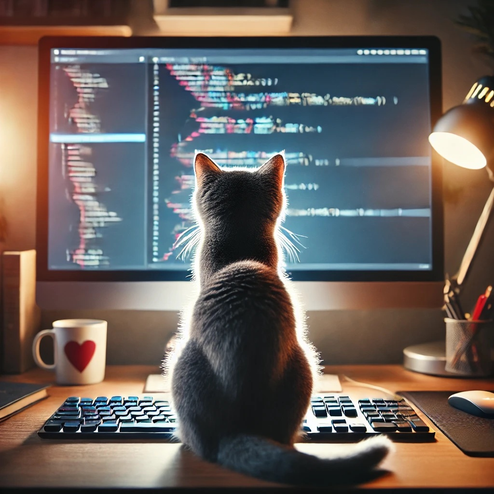

# Hi there! 👋

  

I'm Melanie, a technology enthusiast with a background in environmental sciences. Currently studying programming at 42 School!

Also, I love cats! 🐈‍⬛

## About Me

🌱 I started my journey with a passion for the environment and gaining experience in data analysis.

💻 Transitioning into technology, I'm particularly interested in merging my environmental expertise with programming, leveraging technology for a sustainable future.

## Current Focus

🎓 I have completed the common core at 42 School and am now specializing in machine learning and data science to push the boundaries of innovation.

## Projects

🔍 You can find all my projects on [my 42 School repository](https://github.com/melanieyanez/cursus_42.git), where I'm currently learning and practicing programming languages such as C, C++, JavaScript or Python.

Feel free to explore and provide feedback!

## Skills

📊 **Data Analysis:** Skilled in R, Matlab, and Python for data analysis and visualization. 
🛠️ **Programming:** Experienced in C, C++ and Python for software development and web programming. 
🗃️ **Databases:** Familiar with SQL for database management and querying. 
💡 **Web Development:** Qualified in HTML, CSS, Bootstrap, JavaScript, and Django for creating responsive and dynamic web applications. 
💻 **Terminal Shell:** Proficient with terminal shell commands for automation and system management. 
🧰 **Tools:** Competent with VIM, VSCode, Docker, and Git for efficient coding, containerization, and version control.  

## Let's Connect

📫 Interested in collaborating or have any inquiries? Reach out via [LinkedIn](https://ch.linkedin.com/in/melanie-yanez-pena-4906a8121) or [Email](mailto:melanieyanez@gmail.com).

Let's harness the power of technology to create a sustainable future and innovate for a better world together! 🌍🚀

